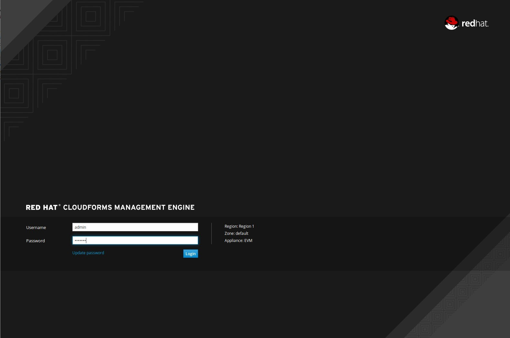
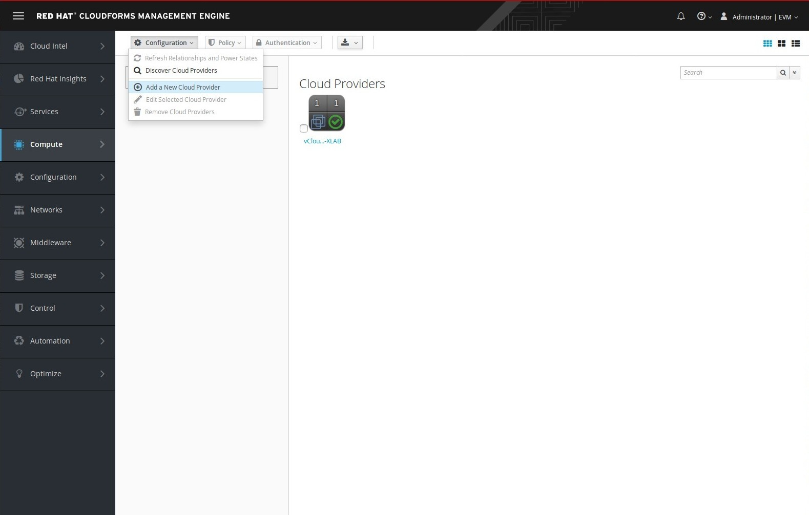
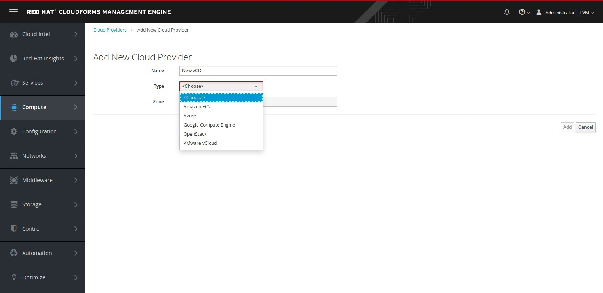
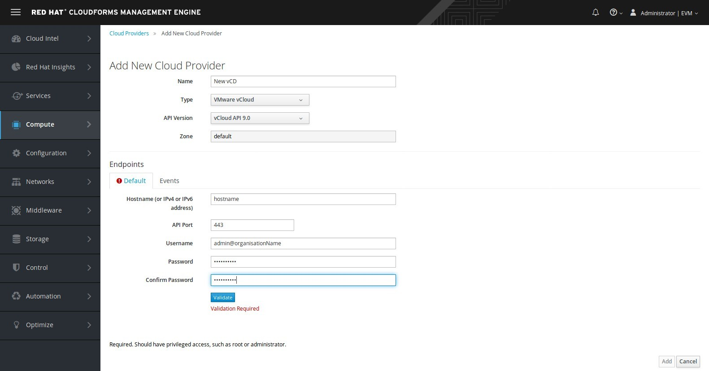
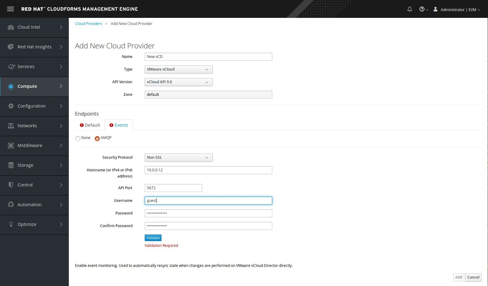

= Adding a VMware vCloudDirector in Red Hat CloudForms

Now that CloudForms, VMware vCloudDirector and RabbitMQ (optional) has been correctly installed, it
is time to add the vCloudDirector as a CloudForms Cloud Provider.

To do so, go to `http://my_cfme_host/` and login with a user who is allowed to
add providers. The default user is `admin` with `smartvm` for his password.

Then navigate to "Compute>Clouds>Providers"

image:../../images/docs_vcd_addPriovider01_nav.jpg[alt="Add a New Cloud Provider"]

Choose "Add a new Cloud Provider"

Select "VMware vCloud"

Fill-in the details with API Version, the IP address (or hostname) and port of the vCloudDirector manager, the username and password used to start login into the vCloudDirector. Note that username is in format of `username@organization`.

Navigate to APMQ tab to fill in RabbitMQ credentials

Validate the data and save the provider. Once this is done, press the add button and view the summary for the vCloud provider.
