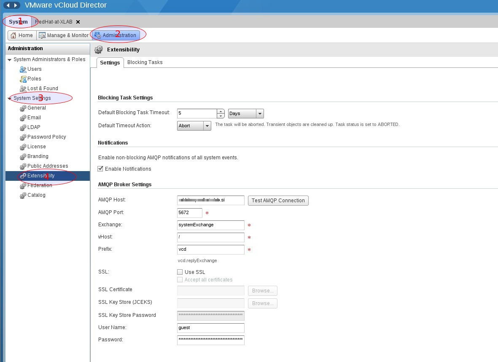

= Enable AMQP Events in vCloudDirector

To enable events from vCloudDirector, the following configuration in vCloudDirector is required. Prerequisite for this step is installed and configured RabbitMQ. For details, please refer to
link:../topics/vcd-rabbitmq.adoc[Event Monitoring with RabbitMQ guide]

To enable AMQP in the vCloud Director a login in as system administrator is required. Note that it is not enough to have (only) administrator role inside the Organization. After this navigate to AMQP settings following "System>Administration>Management>System settings>Extensibility".

Enable AMQP events and fill in the required credentials for RabbitMQ

image:../../images/docs_vcd_rabbitmq_conf_info.jpg[alt="Enable AMQP and fill in credentials"]
