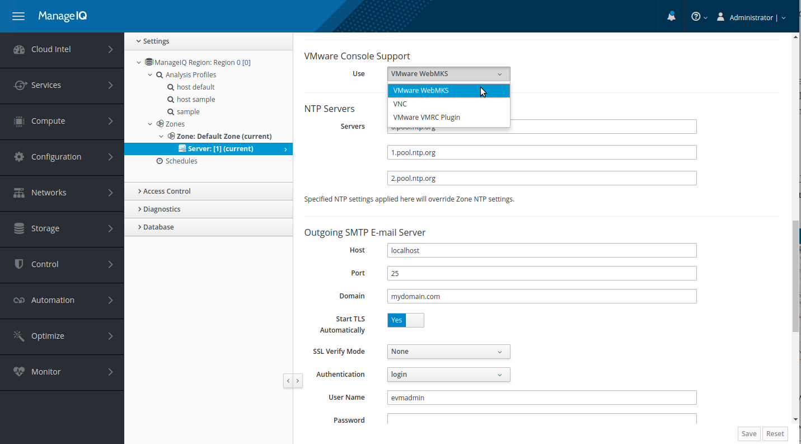
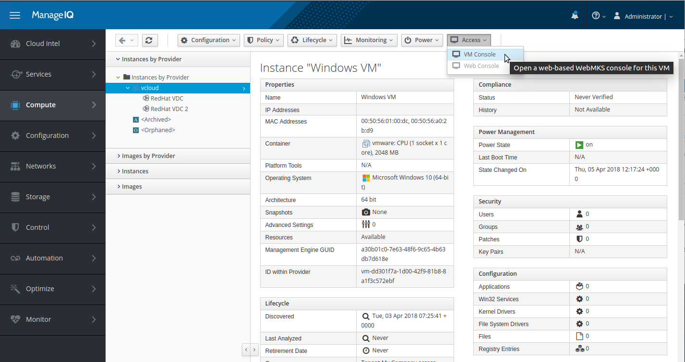
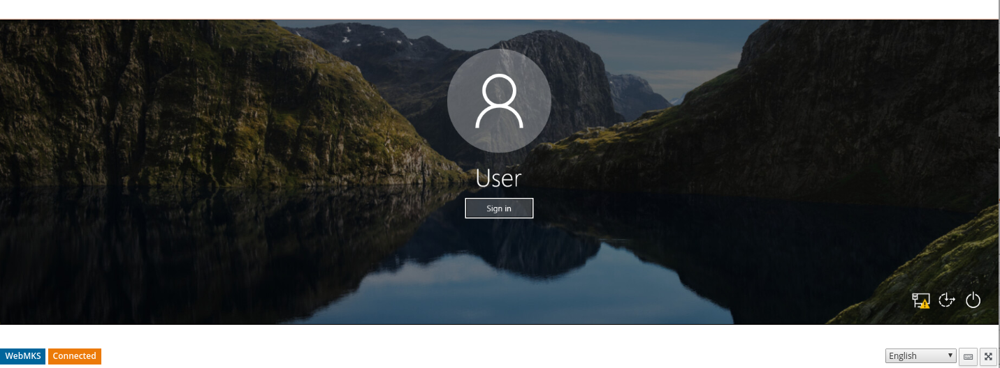
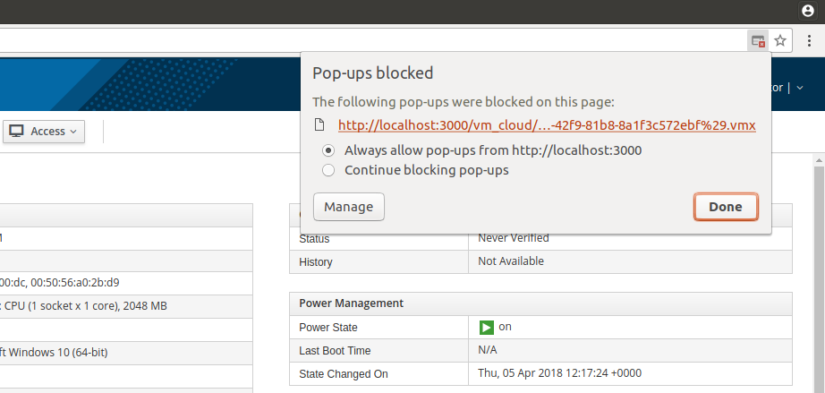

== Remote Console Access to {vcd-provider-full}

*Remote console* is a graphical window that allows you to view desktop of a virtual machine, and to interact
with that virtual machine in a similar way to a physical machine.

{vcd-provider} supports establishing remote console against running virtual machines. Console window
is opened in browser using https://www.vmware.com/support/developer/html-console[VMware HTML5 WebMKS Console SDK].
Due to VMware licensing restrictions, Red Hat cannot ship the WebMKS SDK in {cfme}.

NOTE: {vcd} itself needn't be accessible from user's browser directly since {cfme-appliance} serves as
proxy between the two. Remote console feature should work as long as browser can access {cfme}.

=== Prerequisites
Following prerequisites need to be met in order to be able to use remote console access:

* VMware WebMKS SDK must be installed on {cfme-appliance}.
* *VMware WebMKS* option must be selected as default VMware Console Support.
* Virtual machine that we're establishing remote console against must be powered on.

==== Installing VMware WebMKS SDK on {cfme-appliance-title}
Remote console for {vcd-provider} requires VMware WebMKS SDK to be installed on {cfme-appliance}.
Following steps are needed to install it:

1. SSH to the {cfme-console} as root user.
2. Create a new directory `webmks` in the `/var/www/miq/vmdb/public/` directory.
+
----
/var/www/miq/vmdb/public/webmks
----
+
3. Download and extract the contents of link:https://www.vmware.com/support/developer/html-console/[VMware WebMKS SDK]
   into the `webmks` directory.

Directory structure similar to the one shown below should now reside in the newly created webmks directory.
```
webmks/
├── css
│   ├── extended-keypad.css
│   ├── main-ui.css
│   ├── trackpad.css
│   └── wmks-all.css
├── img
│   ├── touch_sprite_feedback.png
│   └── touch_sprite.png
└── wmks.min.js
```

==== Configure VMware WebMKS as Default Console Type for {vcd-provider-title}
1. Log in to the {cfme-gui} as an administrative user.
2. From the settings menu, select *Configuration*.
3. Click on the *Settings -> Zones* accordion and pick server from your zone.
4. In *Server* tab scroll down to *VMware Console Support* section and pick *VMware WebMKS* option.
5. Click *Save*.



NOTE: *VMware Console Support* setting will affect both {vcd-provider} as well as VMware vSphere provider.
It is currently not possible to use different setting for the each.

=== Using Remote Console Access
Log in to the {cfme-gui} and open details page of a running {vcd-provider}'s virtual
machine. Menu option *Access -> VM Console* appears in center menu.



Click it and remote console will open in a popup window. Focus console by left-clicking into the remote desktop section
to start using virtual machine remotely (mouse moving, mouse clicking and keyboard typing). Close popup when you're
done.



NOTE: If nothing happens when you click on *VM Console* button, please make sure popus are not being blocked by
your browser. See image below.


