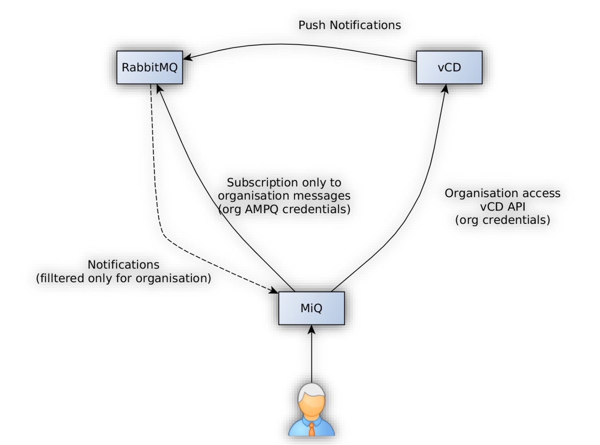
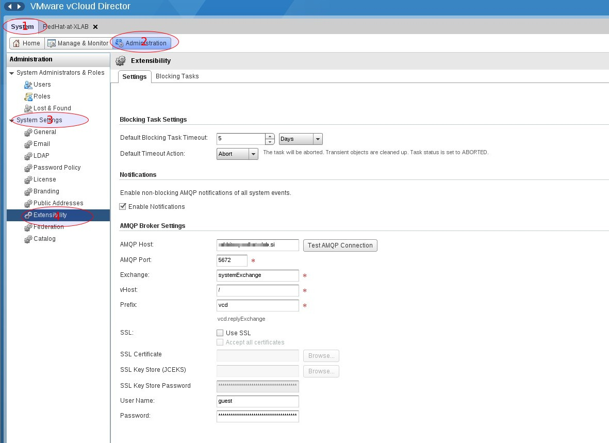
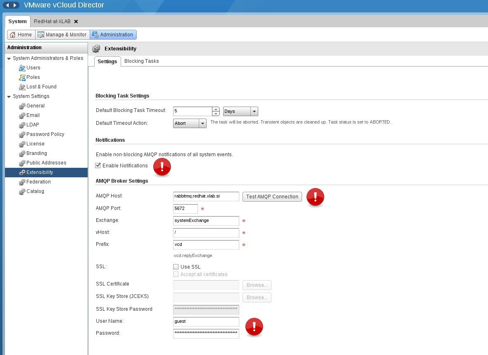
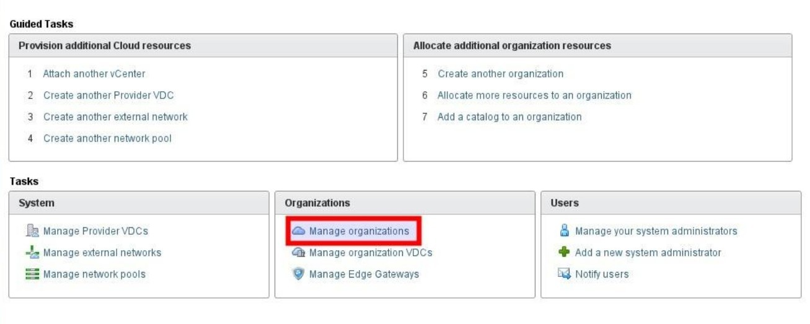
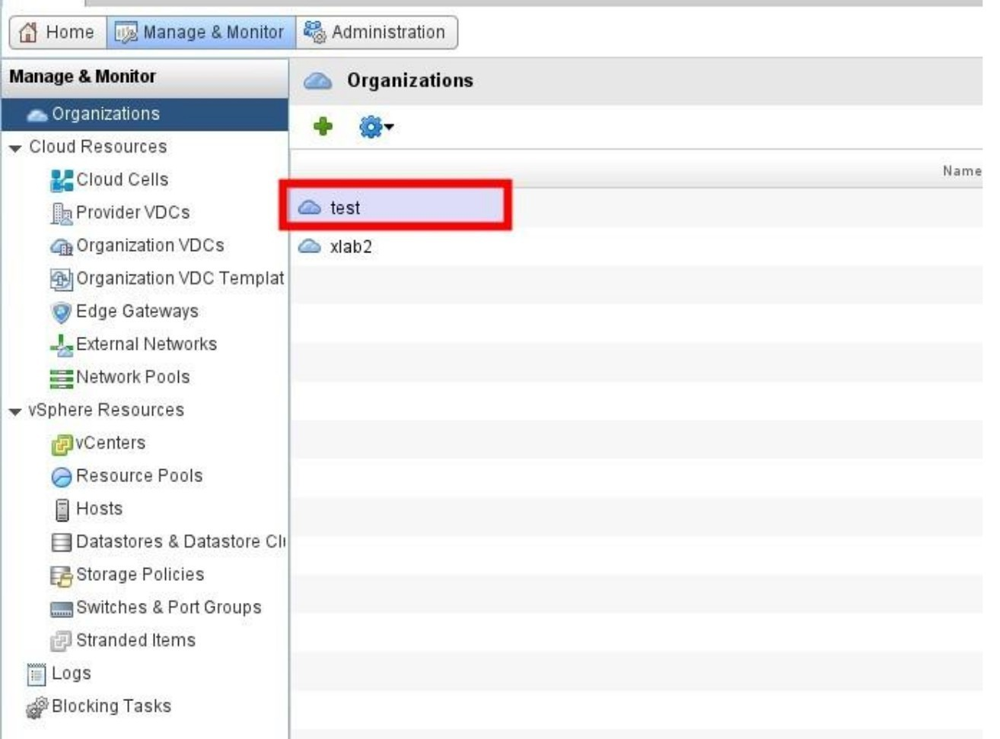
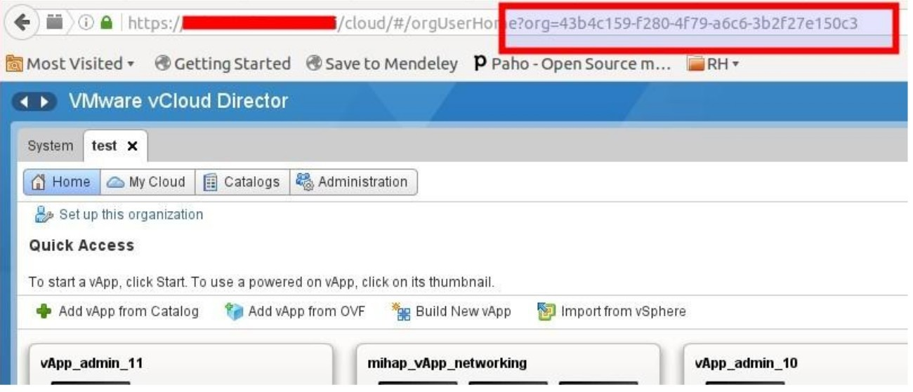
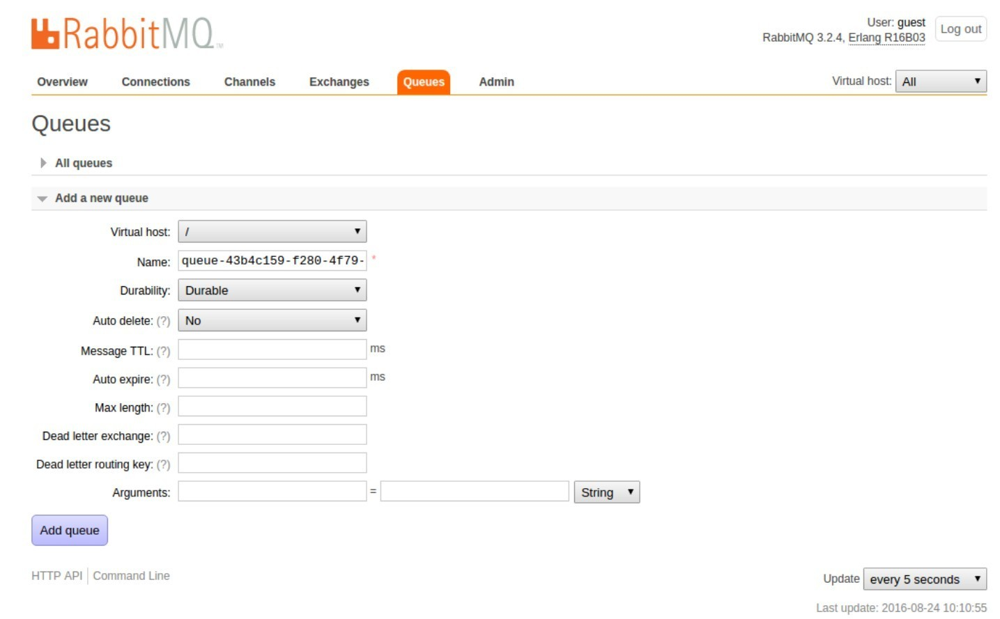
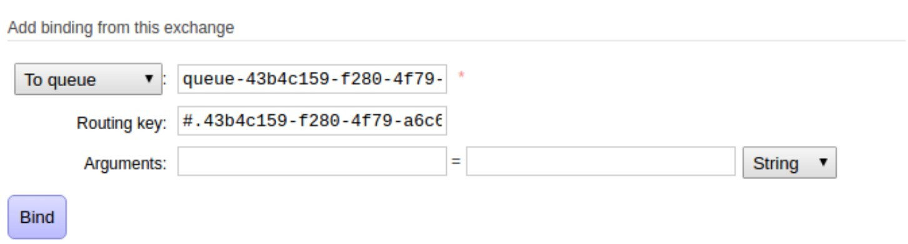
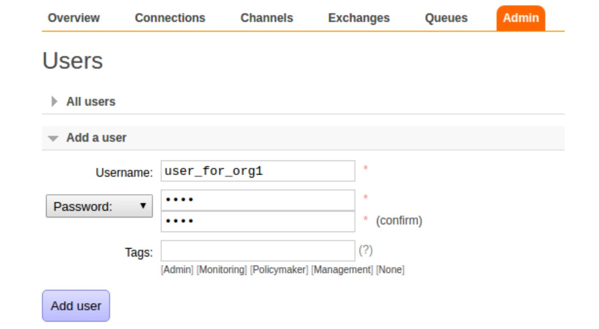
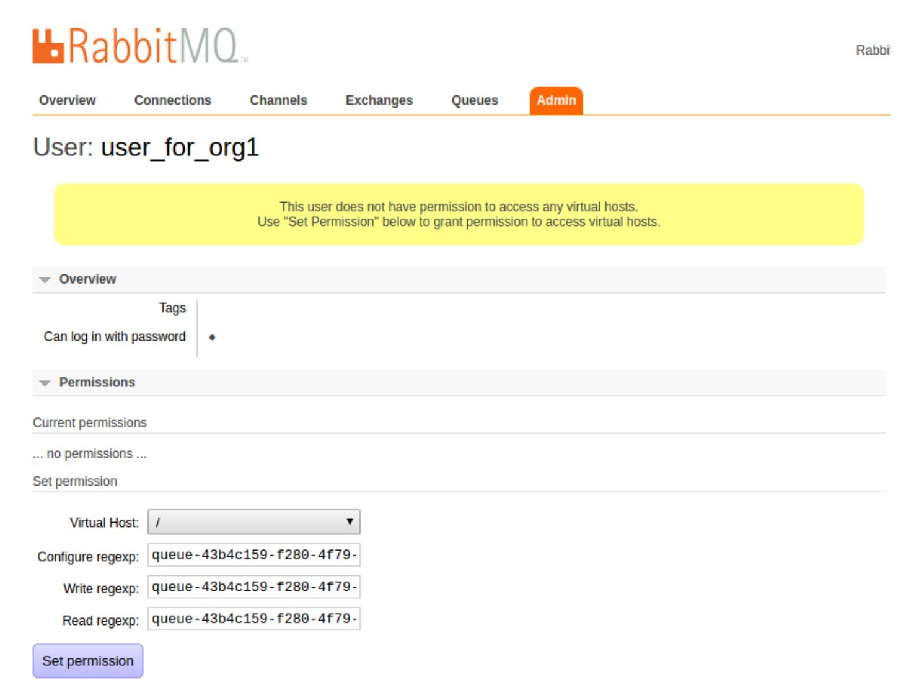

== Event monitoring configuration for VMware vCloud Director

NOTE: Event monitoring is optional, VMware vCloud Director cloud provider can also be added with
event monitoring disabled.

*AMQP Event monitoring* refers to a setup where observed entity emits messages to an AMQP broker where
another entity can consume them. Event monitoring is an improvement over periodical polling for changes
through observerd entity's API for performance reasons.

VMware vCloud Director supports AMQP event monitoring but has it disabled by default. There are two configuration
scopes to take care of to make event monitoring work for vCloud Director cloud provider in CloudForms:

1. Enable AMQP event monitoring option in VMware vCloud Director
2. Configure RabbitMQ for per-organization consumption

Following scheme demonstrates expected setup to support event monitoring for VMware vCloud Director cloud
provider.




=== Prerequisites
We assume RabbitMQ message broker is deployed and accessible both from CloudForms appliance as well as from
VMware vCloud Director's appliance. Administrative access to RabbitMQ and VMware vCloud Director is needed.

=== Enable AMQP event monitoring option in VMware vCloud Director

Following configuration is required in VMware vCloud Director to enable AMQP event monitoring.

Login into VMware vCloud director's graphical interface as system administrator and navigate to
_System -> Administration -> Management -> System settings -> Extensibility_.



Check "Enable Notifications" checkbox and fill in the required credentials for RabbitMQ in
_AMQP Broker Settings_ section.



=== Configure RabbitMQ for per-organization consumption
Having VMware vCloud Director successfully configured to be sending messages to the AMQP broker,
administrator then needs to perform some additional configuration to restrict access to user's own
organization only. Only then it's safe to dispatch RabbitMQ credentials to organization administrators
who manage VMware vCloud Director cloud provider using CloudForms.

RabbitMQ configuration consists of following steps:

* Obtain UUID of the organization
* Prepare queue for organization
* Prepare user for organization

==== Obtain UUID of the organization

Notification messages that are emitted to RabbitMQ are routed based on vCloud Director's organization UUID
(ORG_UUID). Use steps below to obtain the UUID:

 * Login to vCloud Director with administrative access
 * Navigate to organizations view by clicking on "Manage organizations" task



* Navigate to desired organization



* Read UUID from the URL



==== Prepare queue for organization

VMware vCloud Director is sending messages (events, notifications) to AMQP exchange named "systemExchange". Multiple
queues can be subscribed to "systemExchange" exchange, each of them will receive replica of all messages.

Steps below describe how to create a new AMQP queue and subscribe it to "systemExchange" exchange in a way that
only messages for specific organization are delievered to it. CloudForms then consume messages from the queue to perform event-based actions.

NOTE: Steps below demonstrate AMQP queue configuration via Web GUI, but all the configuration can also be
done via CLI.

===== Create queue with predefined name
Follow steps below to create a queue with predefined name so that CloudForms will be able to connect and
consume messages.

Navigate to _Queues_ tab and add a new queue there, to the same virtual host where "systemExchange" exchange resides.
Name it `queue-<ORG_UUID>` and leave all other parameters on default.



IMPORTANT: Please set parameters exactly as shown in the screenshot above, otherwise CloudForms
won't be able to consume messages. If you accidentally, for example, set auto delete to Yes instead No,
Cloud forms won't be able to connect.

===== Subscribe queue to "systemExchange" exchange
Follow steps below to subscribe newly created queue to "systemExchange" exchange so that queue will start receiving
messages from the exchange.

Navigate to _Exchanges_ tab and open up "systemExchange" exchange details. In the _Bindings_ subsection add a new
binding for your queue and assign it following routing key:

```
#.<ORG_UUID>.#
```



Your queue will now receive all messages (events, notifications) regarding specified organization.

=== Prepare user for organization
Having a working queue with predefined name configured, we only need to provide authentication for it yet so that
CloudForms will be able to connect. For this reason we create a new RabbitMQ user and assign it just
enough permissions to access the one queue it needs. Eventually we'll pass this user's credentials to CloudForms
to grant access to retrieve events. Please follow steps below.

==== Create RabbitMQ user
Navigate to _Admin_ tab and add a new user without any tags. Omitting all tags restricts user from connecting to
any queue.

NOTE: User without any tags won't be able to even access RabbitMQ Web UI.



==== Allow user to access one specific queue
Open up user details and set "Configure regexp", "Write regexp" and "Read regexp" permission to point to specific
queue in _Permissions_ subsection. For all three of them simply use queue name and set the permission.



IMPORTANT: Make sure you click "Set permission" button after you’ve input queue names or else configuration won't
be stored and user won't be able to consume messages.

NOTE: "Configure regexp" and "Write regexp" permissions are required due to a bug in underlying CloudForm's library
that fails to connects to the queue unless full permission is given.

=== Summary
Following instructions above the RabbitMQ was configured in a way that it is safe to provide respective organization
administrator with RabbitMQ endpoint URL and AMQP user's credentials. She will only be able to connect to the queue
prepared for her organization and therefore only consume messages related to her organization.
