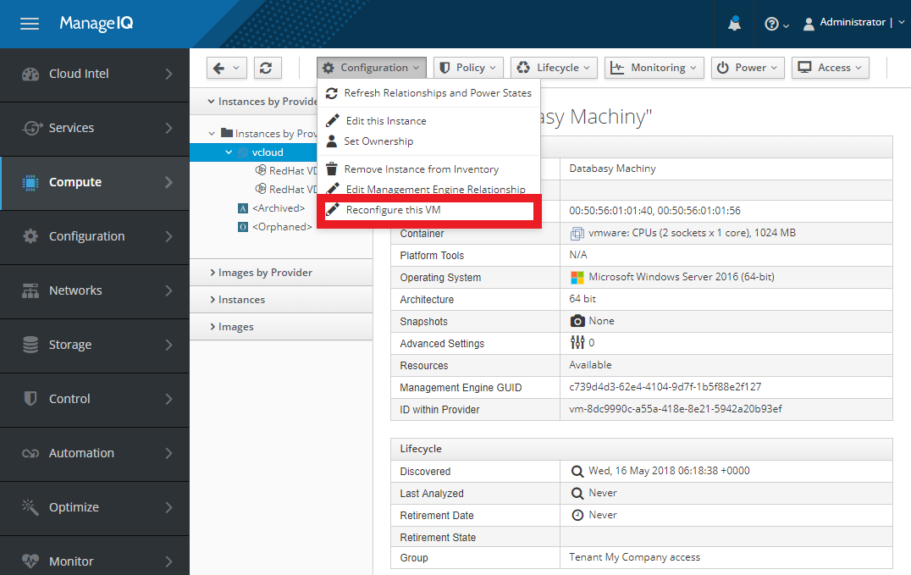
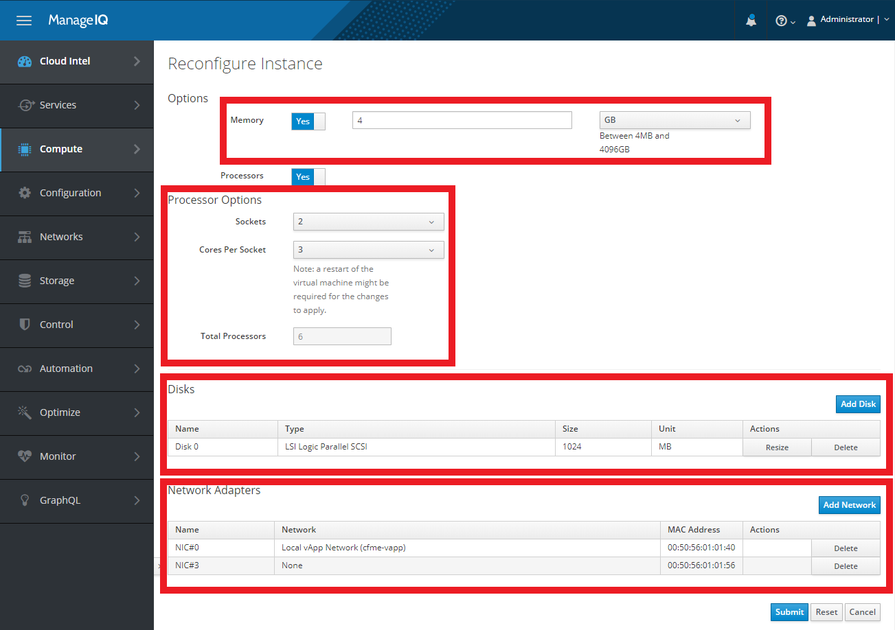

== Virtual Machine Reconfiguration in {vcd-provider-full-title}

*Virtual machine reconfiguration* refers to virtual hardware modifications of an existing
virtual machine. {product-title} offers virtual machine reconfiguration for {vcd-provider}
to some extent and under some conditions.

NOTE: Reconfiguration request can be initiated by {product-title} user,
but has to be approved by {vcd-provider} administrator prior execution.

All virtual machines that are inventoried by {vcd-provider-full} can be reconfigured. Following
reconfiguration actions are supported:

* Adjust number of CPU cores and number of CPU sockets.
* Adjust memory size.
* Increase disk size.
* Delete disk.
* Add a new disk.
* Add a new network interface (NIC) and connect it to vApp network.
* Remove network interface (NIC).

Please note that number of CPU cores and CPU sockets can only be reconfigured when virtual
machine is either turned off or has **Virtual CPU hot add** option set. Similarly, memory
size can only be modified when virtual machine is either turned off or has *Memory hot add*
option set.

=== Prerequisites
Virtual machine reconfiguration process through {product-title} requires:

* **Fast provisioning disabled (affects disk resizing only)** in {vcd-host}. Fast provisioned virtual machines's disks
  cannot be resized due to limitation in {vcd}, unless they are manually consolidated first
  using the {vcd-gui} with top-level administrative account (please see
  https://www.packtpub.com/mapt/book/virtualization_and_cloud/9781782177661/4/ch04lvl1sec47/reducing-the-chain-length-of-linked-clones[Reducing the Chain Length of Linked Clones]
  for more details). Disabling fast provisioning will make sure that disk resizing will
  always succeed.

Following guide assumes {vcd-provider} inventory is successfully fetched.

NOTE: **Fast provisioning** setting only affects disk resizing part of reconfiguration. CPU, memory and
NIC reconfiguration as well as disk removal and disk adding will work independently.

=== Virtual Machine Reconfiguration Process in {product-title}
Login into {product-gui} where you have your {vcd-provider} added. Then follow these steps to
reconfigure a virtual machine.

.Reconfiguration Request
Navigate to virtual machine's details page and select *Configuration -> Reconfigure this VM* in
the center menu.

Reconfiguration form opens offering following four sections to modify virtual machine:
Memory, Processor Options, Disks and Network Adapters.

Input new required resources into reconfigure form and click **Submit**. A request will be
created and sent to {vcd-provider} administrator for approval. You can follow its current
status by navigating to **Services -> Requests** in the main menu and selecting it from the
list.
