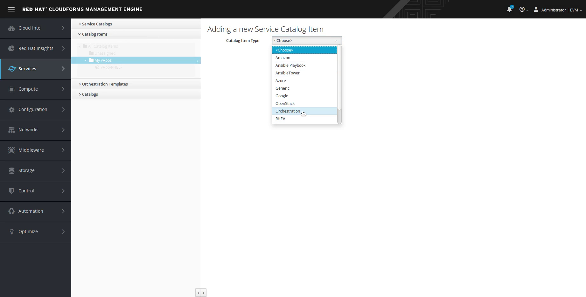

= vApp Provision in vCloudDirector through Red Hat CloudForms

The VMware vCloudDirector uses vApps as a basic entity on which power operations are performed. The vApp can include one or more virtual machines and in CloudForms a vApp is represented as a type of orchestration stack. More informations about vApps can user find on link:https://pubs.vmware.com/vca/index.jsp?topic=%2Fcom.vmware.vca.od.ug.doc%2FGUID-3F4BF45F-89CE-4478-B6D5-5BD7EE749C08.html[VMware pages].

== Prerequisites
.The vApp provision process requires:
* Properly configured vCloudDirector:
 - Valid Organization
 - Organization VCD (virtual data center)
 - Catalog populated with vApps
* Properly configured CloudForms:
 - VMware Cloud provider added (vCloudDirector, organization level access)

== vApp provision process
The vApp provision process is comprised of severals steps. First the Service Dialog is required to be created. After this the new Service Item to provision the vApp is added to the Catalog.

=== Create a service dialog for vApp
In the CloudForms navigate to "Services -> Catalogs -> Orchestration templates". In "All Orchestration Templates" folder find "vApp templates" an choose vApp template. Now from Configuration menu choose "Create Service Dialog from Orchestration template". Choose the name of the Dialog and save the dialog.

=== Create a Catalog item

Note: This step assumes that there is at least one catalog already create.

In the CloudForms navigate to "Services -> Catalogs -> Catalog Items". From Configuration menu, choose "Add New Catalog Item". In "Catalog Item" menu choose "Orchestration".

.Populate the Orchestration dialog with appropriate data:
* Name
* Tick "Display in Catalog"
* Choose Catalog
* Find the dialog, created in "Create a Service Dialog for vApp" step.
* Select a provider

Saving the from concludes the step of creating the catalog.

=== Provision (order) vApp service

In the CloudForms navigate to "Services -> Catalogs -> Service Catalog". Choose the your preferred Catalog where you saved the vApp service item and "Order" the item. Choose stack (vApp) name, Select availability zone, vApp parameters and Network. Submit the order for approval.

