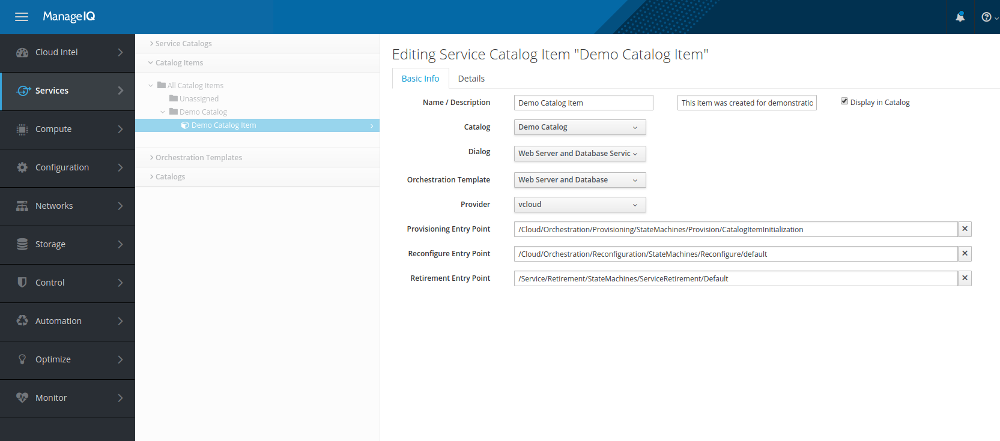
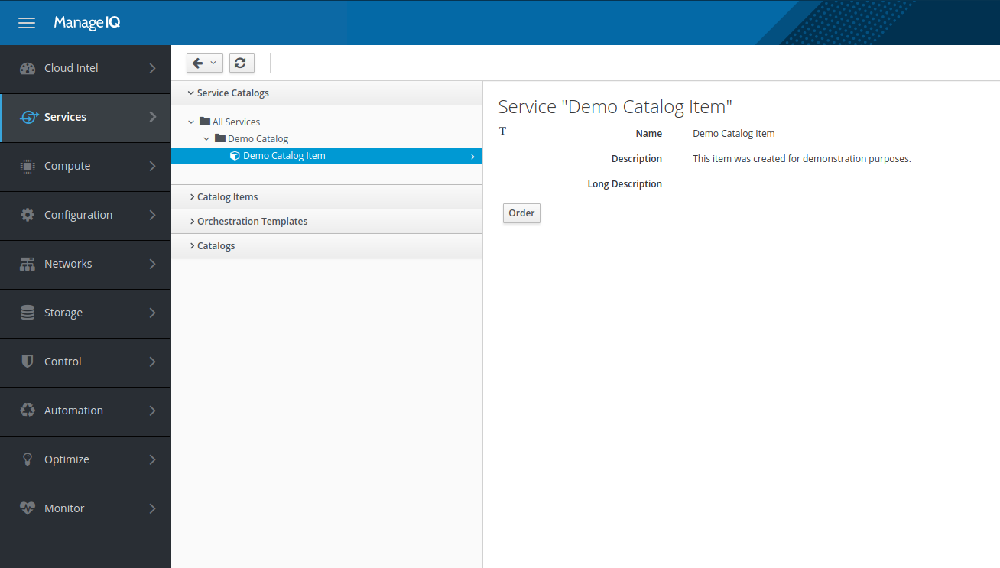
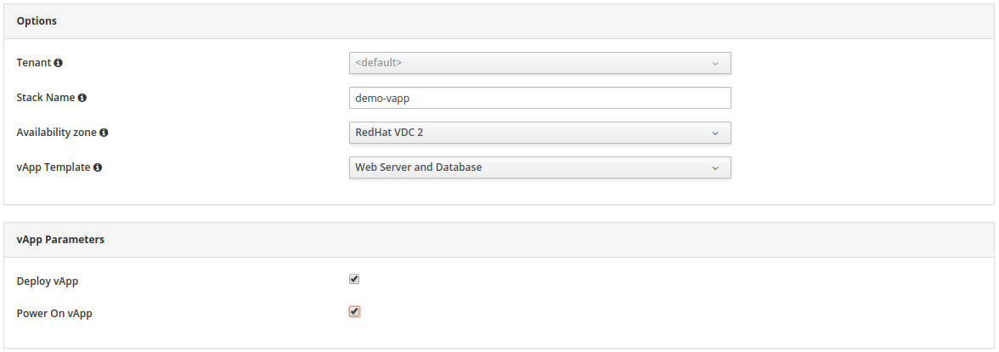
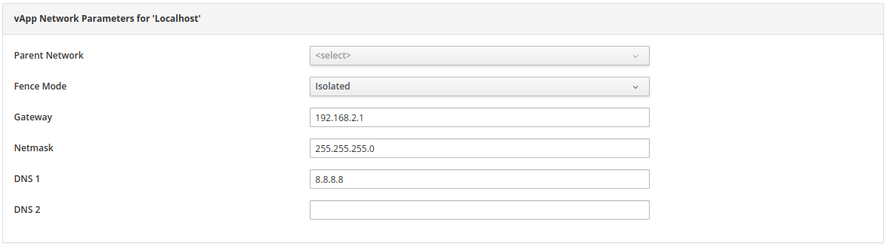
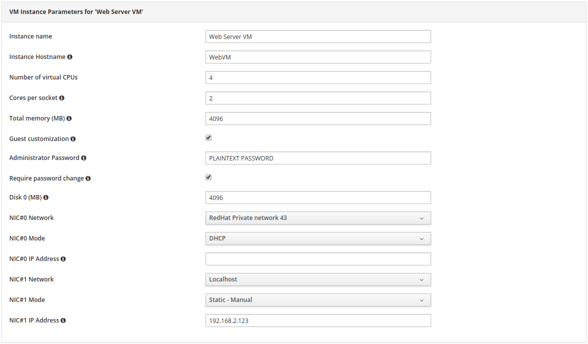

== vApp Provisioning in vCloudDirector through Red Hat CloudForms

*vApp template* is basic entity of provisioning on VMware vCloudDirector. It describes both virtual
machines specifications and vApp networks specifications as well as connection between the two.
In CloudForms, vApp template is inventoried as an orchestration stack template and can be assigned
a service dialog to allow provisioning.

NOTE: CloudForms currently only supports vApp provisioning through vApp template instantiation.
Composing a new vApp is not supported at the moment.

=== Prerequisites
.vApp provisioning process (through CloudForms) requires:
* Properly configured vCloudDirector:
 - desired vApp template must be available in Catalog owned by or shared by our organization. In case
   of shared catalog, CloudForms settings must allow inventoring public images.
 - vApp template should be prepared following some recommendations (please see below) to offer better
   experience to user when provisioning request customization.
* Properly configured CloudForms:
 - Setting `:get_public_images:` must be set to `true` in case we're using vApp template from shared
   catalog. vApp template won't be inventoried otherwise.
 - VMware vCloud cloud provider added and inventory fetched

Following guide assumes VMware vCloud cloud provider inventory is successfully fetched, meaning also
vApp template is stored in CloudForms as an orchestration template. Please verify by navigating to
`Services -> Catalogs` in the main menu and then examining `Orchestration Templates -> vApp Templates`
tab. Your vApp template should be listed there.

=== vApp template design recommendations
CloudForms is able to inventory and provision any vApp template obtained from vCloudDirector, but not all
of them will be fully customizable due to following limitations:

* **Adding/removing vApp networks not supported.** Service dialog supports editing any vApp network that is defined in
  vApp template, but creating/deleting them is currently not supported. Bear this in mind when preparing vApp template
  on vCloudDirector: if you expect user will want to hook VM's NIC to a vApp network, please create it upon vApp
  template creation.
* **Connecting vApp network to VDC network.** Service dialog is currently not able to determine what
  value to select initially in vApp network's drop-down for selecting parent network, therefore it always
  selects none. User is then offered to pick desired VDC/external network to connect vApp network to. Please
  take this into account when preparing vApp template: rather connect all VM's NICs to isolated vApp
  networks and let user connect those to VDC/external networks during provisioning customization.
* **Real-time validation not supported.** Service dialog will capture all the customization parameters
  from user and send provisioning request to CloudForms backend, automation engine, where it will be
  executed. Potential problems with service dialog parameters (e.g. duplicated vApp name) will only be
  visible via CloudForms logging mechanism. For this reason we recommend you to prepare vApp templates in
  a way that minimizes probability of failing request:

   ** Make sure VMs actually boot and that they have VMware Tools already installed. If not, provisioning
   may fail if user opts-in to enable guest customization. Alternatively, make sure guest customization is
   disabled by default to let user know she probably shouldn't turn it on.
   ** Make sure VDC (virtual data center) has enough resources. If no IP addresses are available, for example,
   and user opts-in for IP allocation using IP pool, provisioning will fail.

=== vApp provisioning process
vApp provisioning is a three-step process. First step is catalog item preparation, carried out by VMware vCloud
cloud provider's owner. Catalog item represents orderable unit, ordering one is in fact vApp
template provisioning through CloudForms. Second step is catalog item ordering, carried out by user.
Final step is order approval, carried out by owner:

. Catalog, service dialog and catalog item preparation (owner)
. Catalog item ordering with customization (user)
. Order approval, which results in actual provisioning to happen (owner)

NOTE: New catalog item and service dialog need to be created for each vApp template. But they
can be added to the same catalog.

==== Catalog, service dialog and catalog item preparation
Login into CloudForms where you have your VMware vCloud cloud provider added. Then follow these steps to
create a new catalog and catalog item (with service dialog) that users will be able to order.

===== Prepare catalog
Navigate to _Services -> Catalogs_ in the main menu and then open _Catalogs_ tab. Option _Configuration ->
Add a New Catalog_ appears in center menu. Please pick descriptive catalog name and click "Add".

===== Prepare service dialog
Navigate to _Services -> Catalogs_ in the main menu and then open _Orchestration Templates -> vApp
Templates_ tab. Your vApp template should be listed here. When you select it,  option _Configuration ->
Create Service Dialog from Orchestration Template_ appears in center menu. Please pick descriptive
service dialog name and click "Save".

===== Prepare catalog item
Navigate to _Services -> Catalogs_ in the main menu and then open _Catalog Items_ tab. Option _Configuration ->
Add a New Catalog Item_ appears in center menu.

image:../../images/vcd-vapp04-itemtype.png[alt="Select Orchestration stack"]

Choose "Orchestration" type and populate form with appropriate data:

|=====================================================================================
| "Name / Description"       | catalog item name and description
| "Display in Catalog"       | yes
| "Catalog"                  | catalog that was created in previous step
| "Dialog"                   | service dialog that was created in previous step
| "Orchestration Template"   | vApp template that service dialog was created for
| "Provider"                 | VMware vCloud cloud provider instance that service dialog was created for
| "Provisioning Entry Point" | (leave default)
| "Reconfigure Entry Point"  | (leave default)
| "Retirement Entry Point"   | (leave default)
|=====================================================================================

IMPORTANT: Selected orchestration template *MUST* match vApp template that service
dialog was created from. Provisioning will fail otherwise.

IMPORTANT: Selected provider *MUST* match VMware vCloud cloud provider instance that
service dialog was created for.

Eventually click "Add" to save catalog item. It becomes visible in catalog and therefore available for
users to order it.

==== Catalog item ordering with customization
Login into CloudForms as a regular user. Then follow steps below to customize and order catalog item.

Navigate to _Services -> Catalogs_ in the main menu and then open _Service Catalogs_ tab. Select desired
catalog item from the list and click "Order":

Service dialog opens offering you vApp template customization prior ordering. Exact number of
inputs varies depending on concrete vApp template it bases on, but there are always three main
sections present: basic information section, vApp networks customization section and virtual machines customization
section. You need to fill-in the basic section while other sections are optional and can be left with
default values.

===== Basic information section of vApp template provisioning dialog

Below please find essential fields bold that must always be filled-in. All other fields are optional
and don't need to be modified for provisioning to succeed:

|=====================================================================================
| "Tenant"              | (leave default)
| *"Stack Name"*        | new vApp name
| *"Availability zone"* | VDC to deploy the new vApp to
| "vApp Template"       | (leave default)
| "Deploy vApp"         | whether vApp should be deployed upon provisioning
| "Power On vApp"       | whether vApp should be powered on upon provisioning
|=====================================================================================

===== vApp networks customization section of vApp template provisioning dialog

Service dialog displays one vApp network customization section form (see screenshot above) for each vApp
network from given vApp template. Default values are populated based on vApp template defaults.

|=====================================================================================
| "Parent Network" | VDC/external network to connect this vApp network to. Leave unselected to keep
                     vApp network isolated i.e. limited to vApp only
| "Fence Mode"     | How to connect to parent VDC/external network. Please select "Isolated" when not
                     connecting to any VDC/external network
| "Gateway"        | vApp network's default gateway
| "Netmask"        | vApp network's netmask
| "DNS1", "DNS2"   | IP addresses of DNS servers (optional)
|=====================================================================================

===== VM customization section of vApp template provisioning dialog

Service dialog displays one VM customization section form (see screenshot above) for each VM from given vApp
template. Number of form fields varies depending on number of disks attached to VM and number
of NICs (network interface cards) attached to VM. Screenshot above shows form for VM with one disk (Disk 0)
and two NICs (NIC#0 and NIC#1).

|=====================================================================================
| "Instance Name"          | VM name
| "Instance Hostname"      | VM hostname i.e. computer name (can only contain alphanumeric characters and
                             hypens)
| "Number of virtual CPUs" | how many virtual CPU cores to assign to VM
| "Cores per socket"       | how many virtual CPU cores to assign to each CPU socket (must be a divisor
                             of number of CPU cores)
| "Total memory (MB)"      | VM memory in megabytes
| "Guest customization"    | whether to apply guest customization (administrator password etc.) to the
                             guest operating system. Please enable this only for VMs that support guest
                             customization or provisioning will fail.
| "Administrator Password" | password to apply upon first VM boot. Leave empty to let vCloudDirector
                             autogenerate it for you. Guest customization must be enabled for this to work.
| "Require password change"| require administrator to change password upon first login
| "Disk _n_ (MB)"          | disk size in megabytes. Original value can only be increased, decreasing it will
                             fail provisioning. Form input is rendered per VM's disk.
| "NIC#_n_ Network"        | vApp network to connect NIC to. Form input is rendered per VM's NIC.
| "NIC#_n_ Mode"           | NIC's IP allocation mode. Please also specify static IP address in case you
                             opt-in for Static - MANUAL. Form input is rendered per VM's NIC.
| "NIC#_n_ IP Address"     | NIC's static IP address. Ignored unless mode is set to Static - MANUAL
                             Please make sure IP address is within vApp network's range or provisioning
                             will fail. Form input is rendered per VM's NIC.
|=====================================================================================

Click "Submit" to submit order. Please note that VMware vCloud cloud provider owner needs to approve your order
before it gets provisioned.
